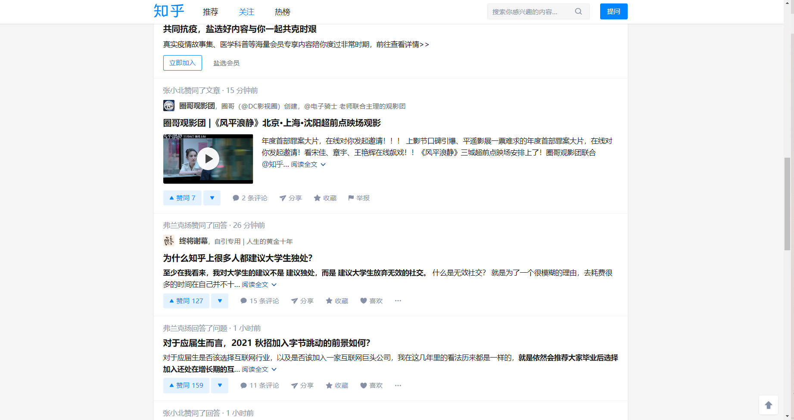
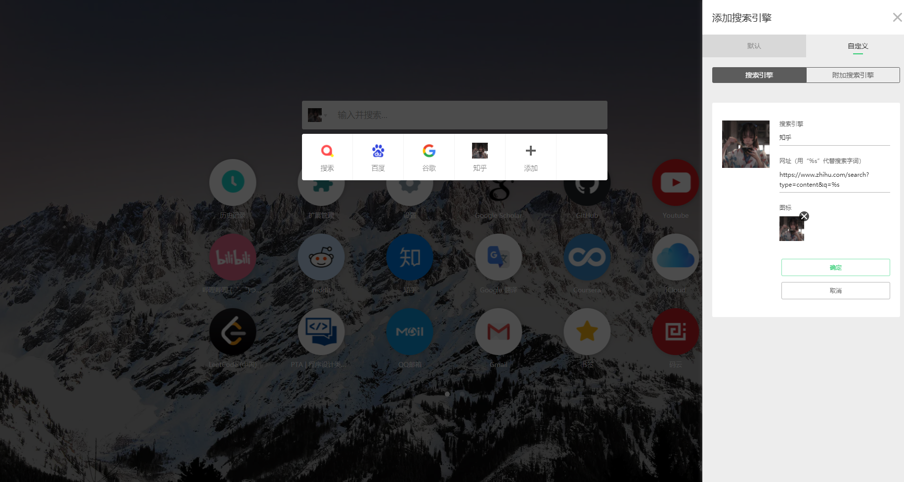

## 我是谁？

只是一个让你能能好好学习的知乎脚本
本人因为经常性的使用知乎查资料，但是经常查着查着就看别的去了，效率很低，所以写了个简单的脚本
消灭一切不定因素！！

## 效果如下

主页：

搜索页：

## 使用方法

你需要下载一个油猴的谷歌插件，然后将zhihu.js文件中的内容复制进去即可
顺便提一句，如果你有使用infinity插件，可以选择添加新浏览器，然后添加知乎的搜索网址，选择自定义,添加下列网址作为搜索地址
https://www.zhihu.com/search?type=content&q=%s

infinity：

